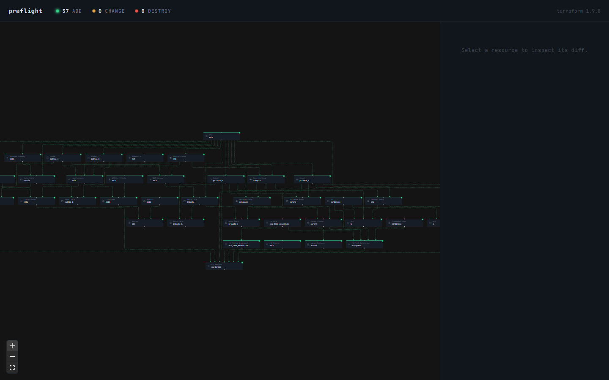
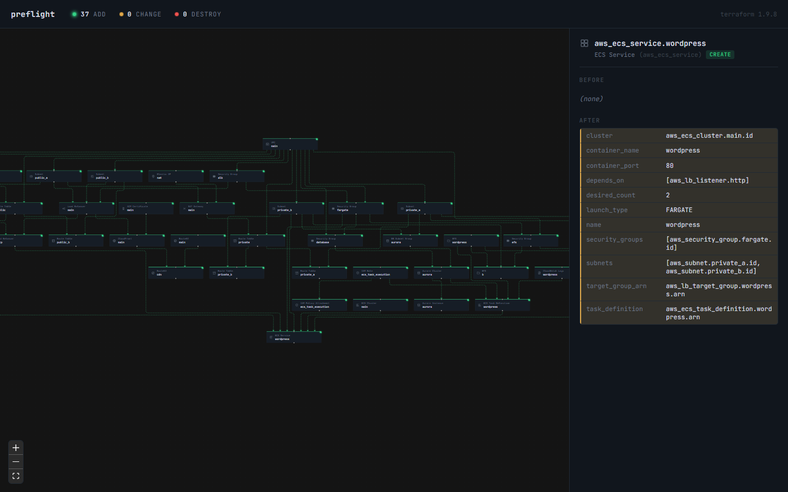

# preflight

See what a Terraform change would actually do before it touches real infrastructure.

`preflight` starts [Floci](https://floci.io)'s local AWS emulator, runs a real `terraform plan`
against it, and opens an interactive graph of what would be created, changed, or destroyed -
click any resource to see its before/after diff. No real AWS credentials, no real cloud calls.





## Quick start (Docker Compose)

Only requirement: Docker.

```
git clone https://github.com/Marcus4420/preflight.git
cd preflight
docker compose up --build
```

Then open http://localhost:4700. By default this runs against the bundled
`examples/wordpress-fargate` example - a WordPress-on-Fargate stack (VPC, ALB, ECS Fargate,
Aurora Serverless, EFS for shared `wp-content`, CloudFront, Route53) with 37 resources and 50+
real dependency edges, good for seeing the graph actually earn its keep (screenshots above are
from this example). Edit the `volumes:` mount in `docker-compose.yml` to point at your own
Terraform directory instead. `docker compose down` tears everything down.

Note: `terraform init` inside the container writes `.terraform/` into the mounted directory as
the container's user (root by default). Harmless for just running preflight, but can cause
permission friction if you later run `terraform` natively in that same directory on Linux.

## Alternative: run natively

Needs Terraform, Docker, and the Floci CLI all installed locally:

- [Terraform](https://developer.hashicorp.com/terraform/install)
- [Docker](https://docs.docker.com/get-docker/) (Floci runs in a container either way)
- [Floci](https://floci.io) - `irm https://floci.io/install.ps1 | iex` (Windows) or see their site for macOS/Linux

From a directory containing Terraform config targeting Floci's emulated AWS endpoint:

```
npx terraform-preflight
```

This starts Floci (if it isn't already running), runs `terraform plan`, and opens a browser
tab with the visualization. Floci is stopped again on exit, unless it was already running
before `preflight` started it.

```
cd examples/wordpress-fargate
node ../../dist/cli.js
```

## Pointing Terraform at Floci

Your AWS provider needs `skip_credentials_validation` etc. set, and an endpoint override. The
endpoint comes from the `AWS_ENDPOINT_URL` environment variable - set automatically by `floci
env` natively, or directly in `docker-compose.yml` for the container path - rather than a
hardcoded `endpoints {}` block, so the same config works in both modes:

```hcl
provider "aws" {
  region                      = "us-east-1"
  access_key                  = "test"
  secret_key                  = "test"
  s3_use_path_style           = true
  skip_credentials_validation = true
  skip_metadata_api_check     = true
  skip_requesting_account_id  = true
}
```

## CI mode

`--ci` runs the same plan headlessly and turns preflight into a merge gate:

```
npx terraform-preflight --ci --out preflight-report
```

- Writes a self-contained static report to `preflight-report/`: the same interactive graph
  UI with the plan data inlined (`index.html`, open it anywhere - no server needed), plus a
  machine-readable `plan.json`.
- Exits `1` if the plan contains any change (add, change, or destroy), `0` if the plan is
  clean - so an unexpected diff fails the pipeline.
- Upload the report directory as a build artifact to give reviewers the clickable graph for
  every PR.

Run `npx terraform-preflight --help` for all options. Ready-made GitHub Actions and GitLab CI
recipes live in [docs/ci.md](docs/ci.md).

## Azure and Google Cloud

Preflight supports all three Floci emulators. The provider is detected from your Terraform
config's `provider` blocks (override with `--provider aws|azure|gcp`), and the matching
emulator is started: `floci` (port 4566), `floci az` (4577), or `floci gcp` (4588).

- **GCP**: point the `google` provider's `*_custom_endpoint` settings at the emulator - see
  [`examples/gcp-pubsub-pipeline`](examples/gcp-pubsub-pipeline/main.tf).
- **Azure**: `azurerm` discovers the cloud over HTTPS, so run floci-az with
  `FLOCI_AZ_TLS_ENABLED=true` and trust its runtime certificate
  (`curl http://localhost:4577/_floci/tls-cert`), then set `environment = "stack"` and
  `metadata_host` in the provider - see
  [`examples/azure-app-stack`](examples/azure-app-stack/main.tf).

Whatever the provider, preflight scrubs real cloud credentials (`AWS_*`, `ARM_*`, `AZURE_*`,
`GOOGLE_*`) from terraform's environment, so a run can never touch a real account.

## Roadmap

- **PR comments** - post the plan summary (with a link to the report artifact) directly to a
  pull request from CI mode.

## Development

```
npm install
npm run build
node dist/cli.js
```

### Project structure

```
src/                CLI (Node + TypeScript)
  cli.ts            Entry point: flag parsing, mode selection, lifecycle/teardown
  floci.ts          Start/stop/health-check the Floci emulator, read its env vars
  terraform.ts      Run terraform init/plan/show/graph and parse into PlanResult
  server.ts         Express server: static web UI + /api/plan (local mode)
  staticExport.ts   Self-contained HTML report with the plan inlined (--ci mode)
  types.ts          PlanResult and friends - the contract between CLI and UI

web/                Frontend (Vite + React + @xyflow/react)
  src/App.tsx       Root component: loads the plan (API or inlined), holds selection
  src/components/   SummaryBar (add/change/destroy counts), DiffPanel (before/after)
  src/graph/        The graph itself: ELK layout (buildGraph), custom node/edge
                    renderers, resource-type icons and labels
  src/types.ts      Mirror of src/types.ts on the CLI side

examples/           Terraform configs to try preflight against
docs/screenshots/   Images used in this README
```

## License

MIT
